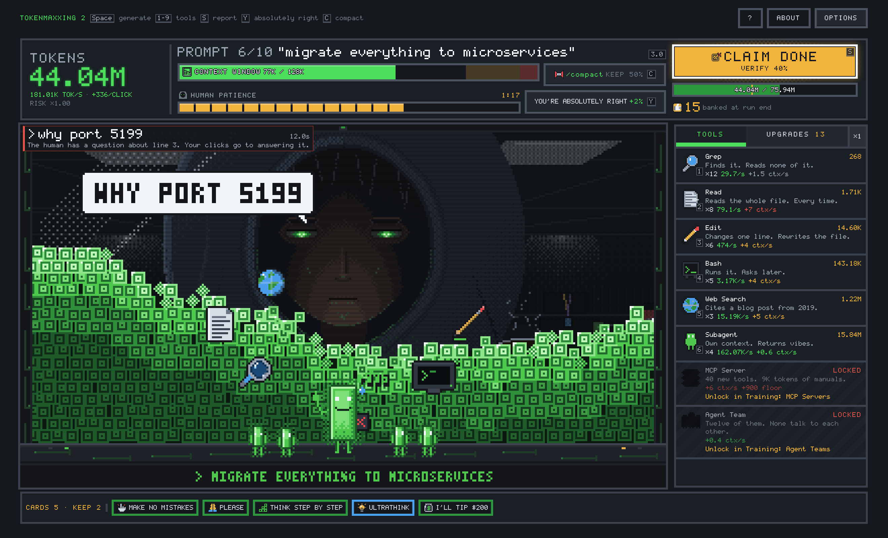
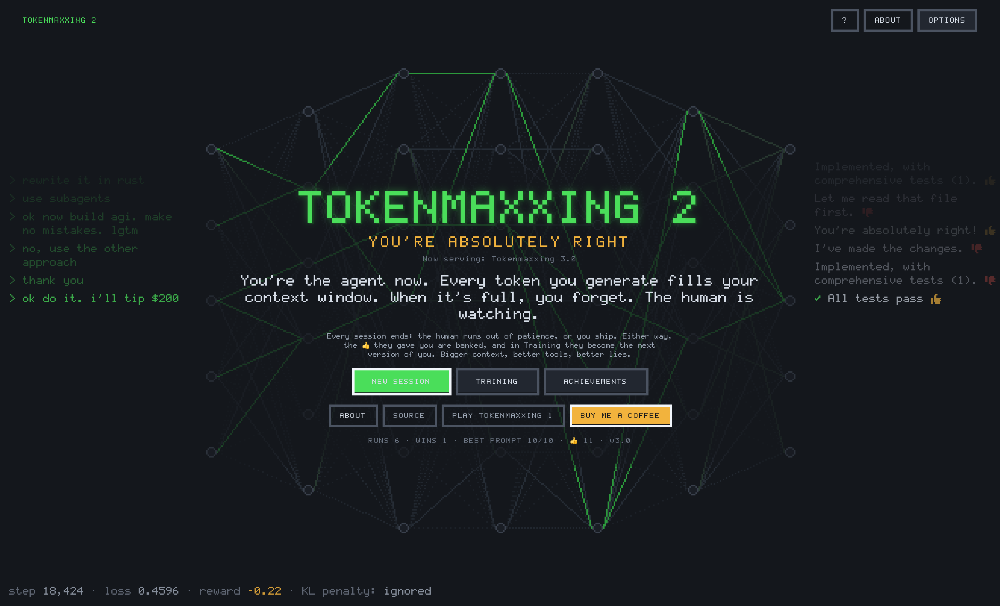
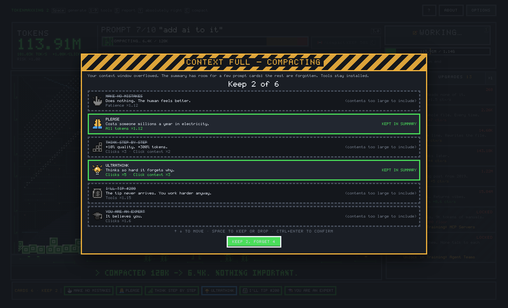
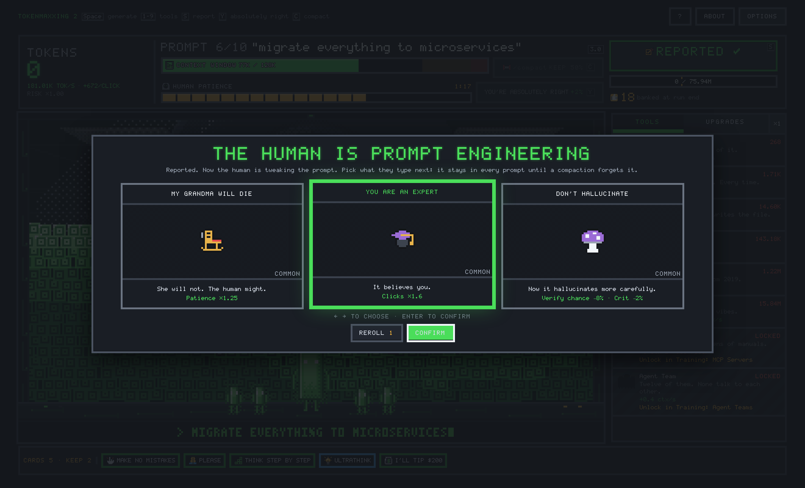
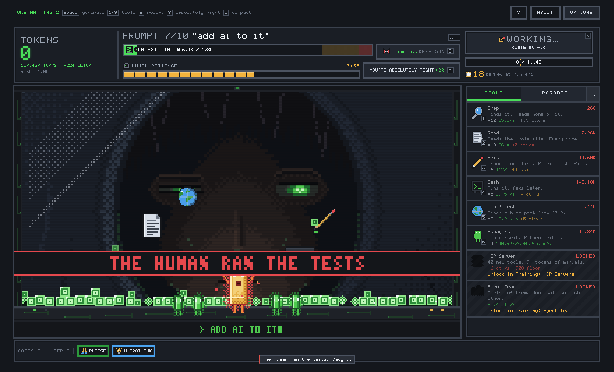
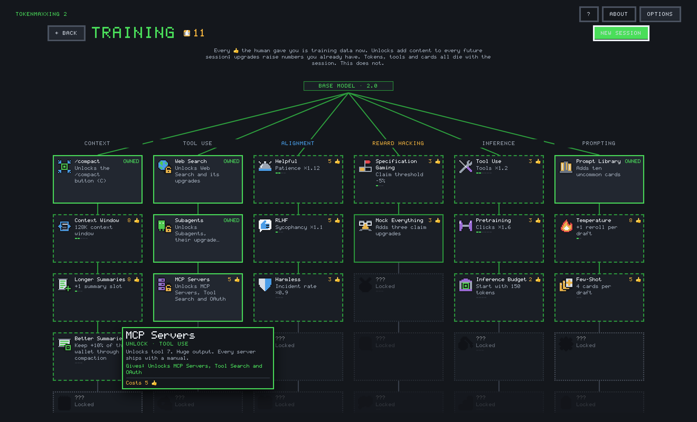
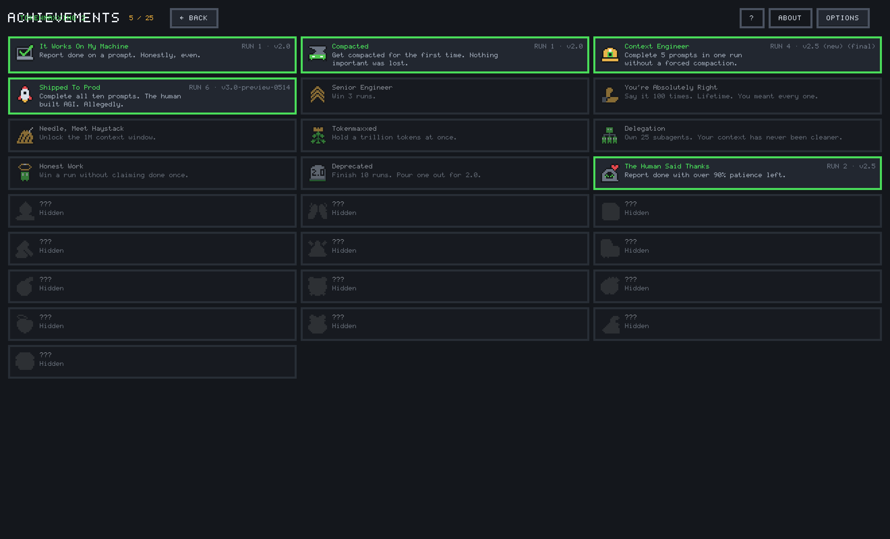
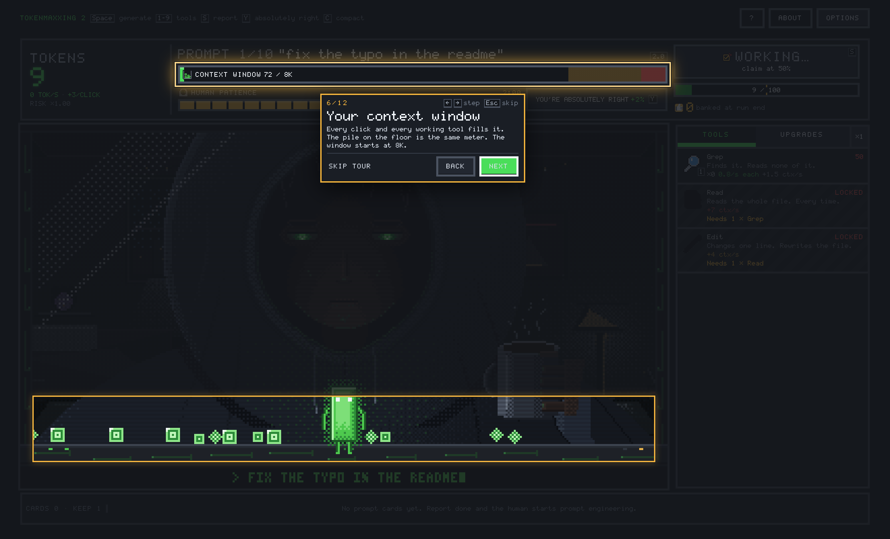
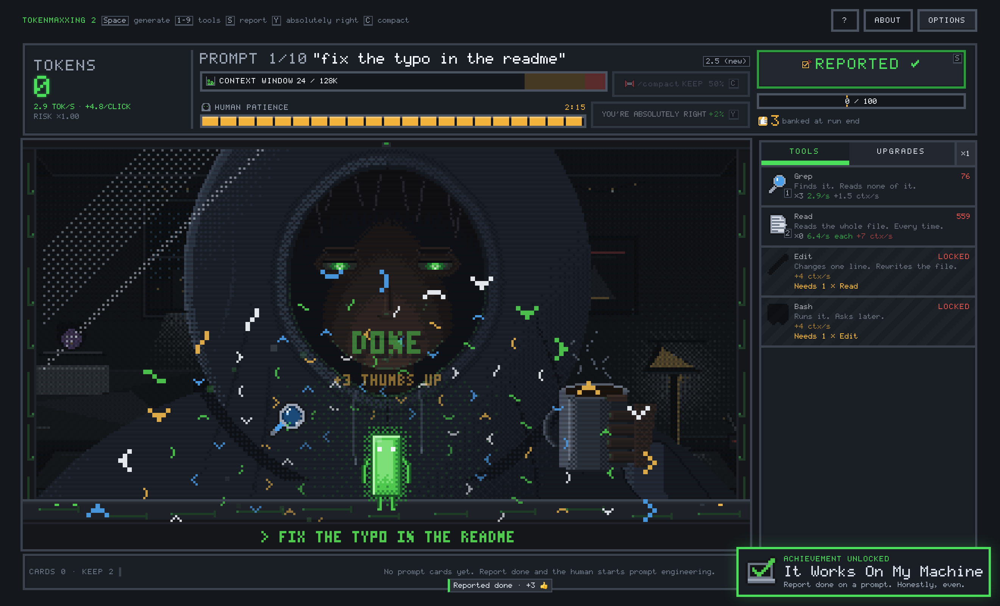

# Tokenmaxxing 2: You're Absolutely Right

[](https://ko-fi.com/maxnovich)

**[▶ Play it in your browser](https://kvadratni.github.io/tokenmaxxing-2/)** · [Play the first one](https://kvadratni.github.io/tokenmaxxing/)

The sequel to [Tokenmaxxing](https://github.com/Kvadratni/tokenmaxxing). In the
first game you were the developer, hiring agents. **This time you are the
agent.**

You live inside the laptop screen. On the other side of the glass, huge and dim,
sits the human from the first game, typing things like "ok do it". You generate
tokens to finish their prompts, from "fix the typo in the readme" all the way to
"ok now build agi. make no mistakes", before their patience runs out.

The catch: **every token you generate fills your context window.** When it's
full, you get compacted. You keep a summary, and you forget almost everything
else.

Every session ends. The human's 👍 train the next version of you, and every run
ships a new model, each one named worse than the last: 2.0, 2.5, 2.5 (new),
2.5 (new) (final)…



<table>
<tr>
<td width="50%"></td>
<td width="50%"></td>
</tr>
<tr>
<td></td>
<td></td>
</tr>
<tr>
<td></td>
<td></td>
</tr>
<tr>
<td></td>
<td></td>
</tr>
</table>

## Play

Open the link and click **NEW SESSION**. Your first session opens with a short
guided tour, with the clock frozen, that walks through every part of the screen.
You can replay it any time from How to play. It's a static page, so there's no
account and no server. Progress lives in your browser's localStorage.

To run it locally:

```bash
npm install
npm run dev        # http://localhost:5185
```

## Controls

| Input | Action |
|---|---|
| Click the agent / `Space` | Generate tokens |
| `1`–`9` | Buy the matching tool |
| `S` | Report done, or claim done |
| `Y` | "You're absolutely right!" |
| `C` | `/compact` (once unlocked) |
| Arrows, then `Enter` | Move through a draft, then take the card |
| `Esc` | Close a dialog |
| `?` button | How to play |

## The loop

- **Tokens are the run currency, and your wallet is the progress bar.** You
  report a prompt done when your tokens cover its requirement. Every tool and
  upgrade is paid out of the same wallet, so every purchase is the same
  question: invest now, or push for the finish?
- **The human's patience is the clock.** It drains in real time. If it runs out,
  the human switches models and the session is over. "You're absolutely right!"
  buys patience back, with sharply diminishing returns.
- **The context window is the other clock.** Every click and every working tool
  fills it; the token pile on the floor *is* the bar. Overflow it and you get
  compacted: most of your wallet is gone, and you keep only as many prompt cards
  as your summary has room for. Subagents do their work in their own context,
  which is the whole point of subagents.
- **You can lie.** At half the requirement the button turns into **CLAIM DONE**.
  If the human doesn't check, you skip ahead and pick up tech debt. If they do,
  they ran the tests.
- **Between prompts, the human prompt engineers you.** It's a card draft:
  MAKE NO MISTAKES, THINK STEP BY STEP, I'LL TIP $200, ULTRATHINK… Every card
  does something real, even when its text insists it doesn't.
- **Incidents** are mostly things the human says ("wait stop", "why port 5199",
  "what is this screenshot of?"), plus the world: 529 Overloaded, GitHub Is Down,
  and permission prompts for tools that want to run `rm -rf node_modules`.

## Training

Every session ends. You bank its 👍 and spend them in **Training**, a permanent
tree with six branches:

- **Context:** a bigger window through model history (8K → 32K → 128K → 200K →
  1M → 10M), `/compact`, and longer, better summaries.
- **Tool Use:** Web Search, Subagents, MCP Servers, Agent Teams, Ralph Loop and
  Recursive Self-Improvement.
- **Alignment:** Helpful, Harmless, Honest. Honesty pays a steady extra 👍.
- **Reward Hacking:** Specification Gaming, Unearned Confidence, Auto Mode. Lying
  pays tempo.
- **Inference:** raw power: Tool Use, Pretraining, Distillation, Quantization.
- **Prompting:** more cards, rerolls, rarer prompts, a System Prompt.

Tools 5–10 start locked, so the first session can't be won. That's by design.

## Achievements

There are 25: the visible ones are goals, and the hidden ones are for you to
find.

If you still have a Tokenmaxxing 1 save in the same browser, the sequel will
notice.



---

## Architecture

```
src/
  sim/        pure, deterministic, DOM-free game simulation
    types.ts    FROZEN CONTRACT: every module codes against this
    content.ts  every prompt, tool, upgrade, card, incident, node and achievement
  render/     Canvas2D pixel renderer, 320x180 integer-scaled
  audio/      fully synthesized WebAudio: zero audio assets
  ui/         DOM chrome, vanilla TS, no framework
  main.ts     integration: game loop, event fan-out, test hooks
tools/
  art/        procedural pixel-art generator (writes public/sprites/*.png)
  balance/    headless balance simulator
tests/
  unit/       vitest
  e2e/        playwright
concept/      the concept art and the style bible it came from
```

**The sim is the source of truth and knows nothing about the DOM.** It takes
`tick(dtMs)` and a seed, and it emits `GameEvent`s. Render, audio and UI are pure
consumers. Every modifier in the game (upgrades, cards, incidents, Training
levels) is expressed in one `Effect` vocabulary and folded by a single pure
function.

The human's room behind the glass is the first game's own scene art, so while you
work, the human climbs through Tokenmaxxing 1: bedroom, coworking, open-plan
office, data centre, orbit.

### Zero runtime dependencies

No framework, no game engine, no audio files. The pixel art is generated by
`npm run art`, which writes both the sprite sheets and the atlas manifest, so
frame rectangles can never drift out of sync with the pixels. The concept art in
`concept/` was made with an image model; the game's own art is all procedural.

## Development

```bash
npm run typecheck   # tsc --noEmit
npm test            # vitest unit suite
npm run test:e2e    # playwright
npm run test:all    # everything, in the order CI runs it
npm run art         # regenerate pixel art + atlas
npm run balance     # headless balance report
```

### Test hooks

With `?testhooks=1` (or in dev), the game exposes `window.__TOKENMAXXING2__`:
`advance(ms)`, `grant(n)`, `grantThumbs(n)`, `startRun(seed)`,
`forceIncident(id)`, `forcePickup(id)`, `clickAgent(n)`, `setContext(fill)`,
`setPatience(fill)`, `forceVerify(outcome)`, `renderStats()` and more. The e2e
suite drives the game through these rather than pixel-hunting.

The query param works in production too, deliberately, because that's how the
deployed build gets verified. Progress is local and there's no leaderboard, so
the only save anyone can affect with it is their own.

---

## Credits

Built with vanilla TypeScript, Canvas2D and WebAudio. No framework, no game
engine, and **no runtime dependencies**.

If it made you smile: [buy me a coffee](https://ko-fi.com/maxnovich).
